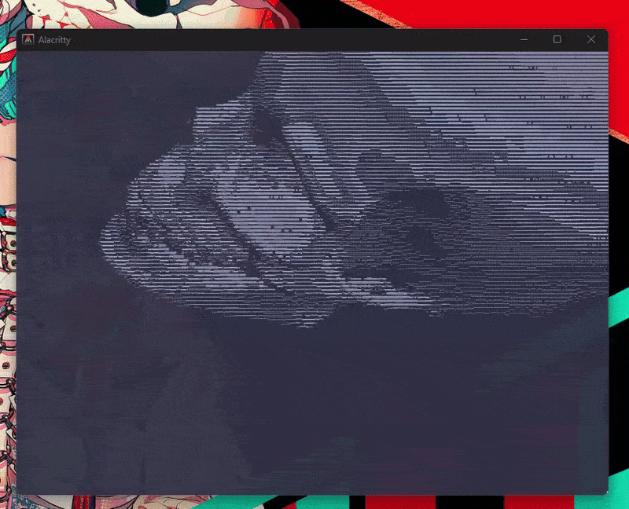

3d engine fully implemented in rust (almost) no external libraries except for some minor windows api things for getting the terminal size and input

Skull spinning

Basic ahh 3d engine

    I still need to seperate the renderer struct into an engine struct and a renderer struct and I want to abstract some things further then I can use this project to build some cooler stuff like physics engines and games

this was a pretty fun project to work on , I got to understand a lot about engines like why they use 4d Matrices and some optimizations 
Also I was forced to learn some optimization and what my code was actually doing under the hood like when I should move , when I should clone , when to use references and when I should pass pointers. And the basic linear algebra was really nice 

3Blue1Browns series is a life saver

This is probably one of the first times actually switching from a quadratic time complexity solution to instantenous was actually noticable 
